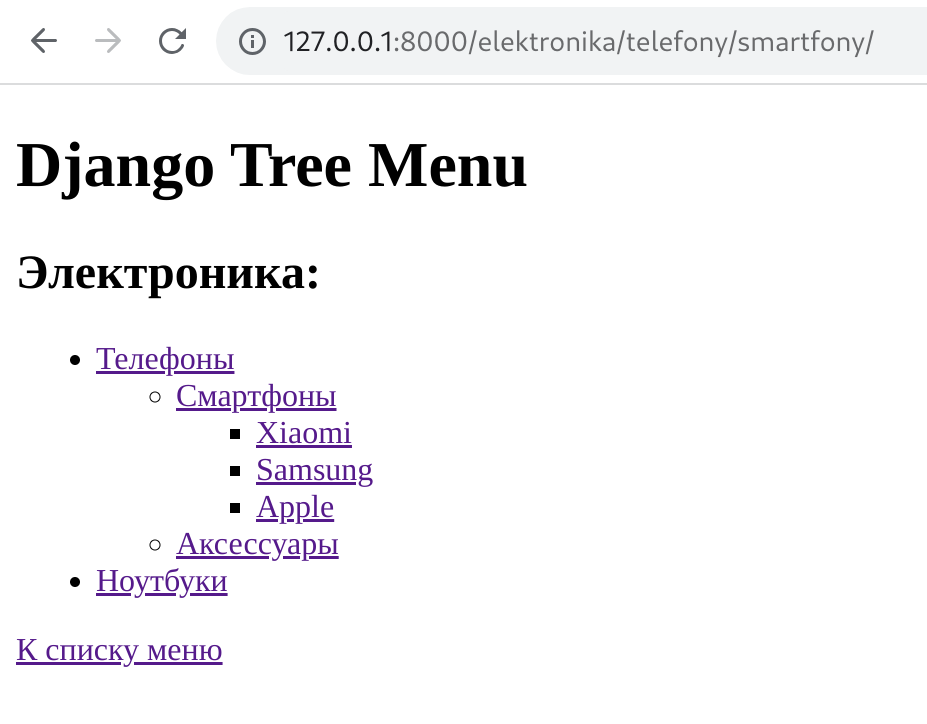

# Django Tree Menu
### Древовидное меню на фреймворке Django


## Установка
Вариант 1 - с помощью Docker:
- Склонируйте к себе репозиторий
```
git clone git@github.com:Konst-Pav/django-tree-menu.git
```
- Запустите проект в контейнере
```
docker compose up
```
Приложение запустится локально на порту 8000.

Вариант 2 - с помощью poetry:
- Склонируйте к себе репозиторий
```
git clone git@github.com:Konst-Pav/django-tree-menu.git
```
- Установите poetry (https://python-poetry.org/docs/#installation)
```
pipx install poetry
```
- Установите зависимости 
```
poetry install
```
- Запустите файл setup.sh, он выполнит миграции и настроит приложение
```
. setup.sh
```

По умолчанию в приложении будет создан суперюзер(username=admin, password=admin).
Эти данные можно изменить создав в корне проекта файл .env

Создано с помощью:
- python = "^3.11"
- django = "^5.1.2"
- python-dotenv = "^1.0.1"
- django-debug-toolbar = "^4.4.6"
